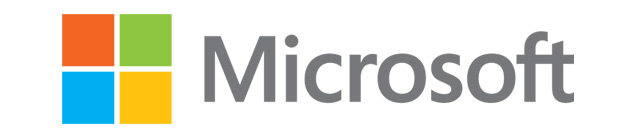

A month back, I wrote that I really liked Microsoft’s new design language. It was a comment in response to their new website preview. The design felt modern, fresh and that Microsoft was still a company that mattered.

The new website design used the Metro aesthetic (or “[Windows 8 style UI](http://www.bbc.com/news/technology-19108952)” I should say). Large tiles, based on a grid, with considered typography and bright, youthful colours.

Fast-forward to today.

Two days ago, [Microsoft unveiled a new logo](http://blogs.technet.com/b/microsoft_blog/archive/2012/08/23/microsoft-unveils-a-new-look.aspx) - the first time they have done so in 25 years. And, for me, the promise that the Metro design aesthetic brought, the promise that Microsoft was still relevant, has gone. Let me explain.

Recognise anything in the logo above? *The Windows logo*. Windows, of course, being Microsoft’s flagship product. I think that aligning the companies branding with their flagship product is a mistake.

It seems short sighted of Microsoft to push the Windows brand so strongly.  This has long been a critism of CEO Steve Ballmer: that he is too attached to Windows and that they should be creating new brands. Especially when many people still associate Windows with negative connotations.

To then align that brand with the company? Microsoft = Windows. That’s it.

This was Microsoft’s opportunity to show that they are more than just a computer operating system provider and that they want to innovate. I think they failed on that opportunity.